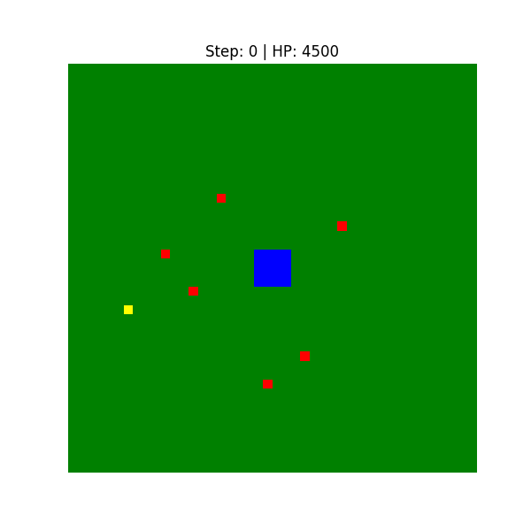

# Clash of Clans - Reinforcement Learning Attack Agent

This is a deep reinforcement learning agent that learns how to attack Clash of Clans bases. It controls the Royal Champion hero on a procedurally generated TH15 base, figuring out where to cast Invisibility Spells and which buildings to target (Town Hall first, then Air Defenses) through trial and error with a Deep Q-Network.



---

## What This Does

The project builds a simplified CoC attack as a grid-based RL environment and trains a DQN to play it. The agent learns:

- Where and when to drop Invisibility Spells to keep the Royal Champion alive
- Target priority — Town Hall > Air Defenses > everything else
- Spatial reasoning across a 44x44 tile grid with 11 building categories

Everything runs in a single Jupyter notebook: the environment, the network, the training loop, and the replay visualization.

---

## How It Works

### Environment (`CoCEnv`)

The environment simulates a CoC attack on a 44x44 grid. Each tile can hold part of a building (Town Hall, Air Defense, Cannon, walls, etc.). The agent sees 3 channels stacked together:

1. **Building ID grid** — what's placed where
2. **Value grid** — strategic importance of each tile
3. **Invisibility timer grid** — remaining spell duration per tile

The action space is 1,937 discrete choices: 1 wait action + 1,936 grid cells where the agent can cast an Invisibility Spell. The Royal Champion moves and attacks automatically based on a built-in target priority system — the agent only controls spell placement.

Rewards are shaped to teach priority:
- +1000 for destroying the Town Hall
- +300 per Air Defense killed
- Penalties for taking damage and targeting low-priority buildings

### DQN Architecture

4-layer convolutional network:

```
Input (3 x 44 x 44)
  -> Conv2d(3, 32, 3x3) + ReLU
  -> Conv2d(32, 64, 3x3) + ReLU
  -> Conv2d(64, 64, 3x3) + ReLU
  -> Flatten -> FC(123904, 512) + ReLU
  -> FC(512, 1937)   # Q-value per action
```

### Training Details

Standard DQN setup with experience replay and a target network. Epsilon decays from 1.0 down to 0.01 over training. The agent was trained in stages with increasing difficulty:

| Tier | Episodes | What Changes |
|---|---|---|
| `hard_v2` | 2,000 | Fewer defenses, learning core mechanics |
| `pro` | 1,500 | More defenses, tighter reward signals |
| `master` | 1,500 | Full defense roster |
| `th15` | 5,700+ | Complete TH15 base, ran for 10+ hours |

Checkpoints were saved every 100-500 episodes throughout.

---

## Project Structure

```
clashOfClansAgent/
├── README.md
├── .gitignore
├── notebooks/
│   ├── Clash_of_Clans_Agent.ipynb    # main notebook — everything lives here
│   └── test.ipynb                     # scratch / testing
├── media/
│   └── battle_replay.gif             # demo of trained agent attacking
└── checkpoints/                       # not in repo (gitignored, ~26 GB)
    ├── rc_hard_v2_*.pth
    ├── rc_pro_*.pth
    ├── rc_master_*.pth
    └── rc_th15_*.pth
```

The `checkpoints/` folder has all the trained model weights but they total ~26 GB, so they're excluded from the repo. You'll need to train locally to generate them.

---

## Getting Started

You need Python 3.8+, PyTorch (CUDA recommended), NumPy, Matplotlib, and Jupyter.

```bash
git clone https://github.com/steven1423/clashOfClansAgent.git
cd clashOfClansAgent
pip install torch numpy matplotlib jupyter
```

Then open the notebook and run through the cells:

```bash
jupyter notebook notebooks/Clash_of_Clans_Agent.ipynb
```

Cell 1 generates and visualizes a random TH15 base. The following cells set up the DQN and kick off training.

---

## Built With

- **PyTorch** for the neural network and training loop
- **NumPy** for the grid environment and state representation
- **Matplotlib** for base visualization and training plots
