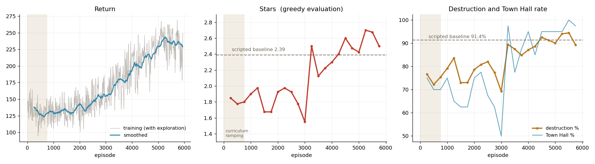

# clash of clans attack agent

This is an RL agent that learned to play my whole TH15 attack (in simulation).
My army is a royal champion charge into mass dragons — the RC walks the core
under a chain of invisibility spells and deletes the anti-air, then 14 dragons
come in from whatever side the air sweepers aren't facing. The agent makes every
decision I would make: where to drop the RC, when to spend each invis, when to
fire seeking shield, when to give up on the charge and commit the air army,
where the two funnel baby drags go, which side the dragon stack enters from,
queen and warden placement, tome timing. Everything else (hero pathing, dragon
targeting, defenses shooting back) is simulated the way the game actually does
it — every stat in config.py has a wiki citation next to it.


## results

First real run, 10 hours on my laptop cpu, ~5,900 episodes, evaluated over 120
attacks per policy:

```
random                    1.12 stars   62.8% dest    0.0% triple
dragons only, no charge   1.52 stars   63.0% dest    4.2% triple
scripted attack           2.39 stars   91.4% dest   46.7% triple
trained agent             2.72 stars   95.1% dest   73.3% triple
```

The agent beats the hand-written strategy, and the charge is clearly worth
something because dragons-only is miles behind both.



The dip around episode 3,000 is the training wheels coming off — early training
leans on demonstrations plus a scripted teacher mixed into exploration, both
anneal to zero around there, and the policy wobbles for a thousand episodes
before passing the baseline for good.

Honesty section: those numbers are out of date now, and not in my favor. While
building the vision stuff below I found two bugs in the base generator that had
been making every practice base easier than a real one. Placement worked by
random guessing and gave up when the base got crowded, so bases were shipping
with about five defenses missing (6.6 archer towers instead of 8, 5.7 cannons
instead of 7...). Worse, half of them had no clan castle, which means no
defending CC troops on those attacks. Both fixed — placement scans for spots
now, and the important buildings go down before the filler, the way an actual
builder does it. On the corrected bases the old agent drops to 1.82 stars and
loses to the scripted baseline (2.25 / 89.9%). It wasn't overfitting to noise
exactly — it mastered a village that doesn't exist. The scripted policy still
triples 37.5% of the corrected bases so the task is clearly winnable, the agent
just has to relearn it. Retraining is the same command, it picks everything up.

## the army, for context

TH15. Royal champion with electro boots and spirit fox, archer queen with the
giant arrow, grand warden on air, dragon duke. 14 dragons + 2 baby dragons, 11
invisibility spells, stone slammer carrying 2 more dragons and a baby, 3 more
invis in the CC. So 14 invisibility total, which sounds like a lot until you
realize each one lasts 4.25 seconds.

## what the attack actually is

The RC charge is a real strategy, not something I invented. She targets the
NEAREST DEFENSE — not the town hall, not air defenses, whatever is closest,
skipping every non-defense building on the way. Since the giga inferno the town
hall counts as a defense, so deploy her on the TH side and it's near the front
of her queue. Invisibility does two jobs with one spell: cast on her she's
untargetable, cast on a building SHE ignores it and keeps walking — protection
and pathing control from the same action. And invis resets inferno ramp, which
is the difference between eating 100 dps and 2,300.

Then the air phase. Dragons fly at the nearest building, collectors included,
which is the entire reason funneling exists — one uncleared hut three tiles off
axis peels the whole stack sideways. Baby dragons get double damage when no
allied air is within 4.5 tiles, so the two funnel babies have to be far from the
stack AND far from each other, or you've thrown away both funnels. Air sweepers
push, so the stack enters from the side they don't cover. The queen's giant
arrow crosses the whole map and hits air defenses for double — if two ADs sit on
a line you can reach from the deploy zone, one arrow kills both, which is why
good builders offset their AD diamond a couple tiles (and my generator knows
that: symmetric layouts keep the exploitable line, askew ones jitter it away).

## the base generator

Walls first, like a real builder. Build the wall skeleton, carve it into
compartments, assign buildings into compartments by role: TH / CC / eagle never
share one, air defenses in a deep diamond, monolith behind the town hall,
scattershots as islands, storages hugging the ADs to soak lightning. Four
archetypes (box / diamond / ring / askew) weighted roughly like what you meet in
war. Every base gets flood-filled to prove there are no open compartments,
because troops strolling in through a gap invalidates everything downstream.

## reading real bases off the screen

This exists because I wanted plans against the actual base on my screen, not
just generated ones. Screenshots in, 44x44 grid out, trained agent plans on it.

It does NOT touch the game. No taps, no automation. It reads pixels and prints a
plan, you play the attack yourself. Supercell bans for input automation, and the
recognition was the interesting problem anyway.

Things learned the hard way, written down so nobody repeats them:

Clash does not render 2:1 isometric. Everyone assumes game tiles are twice as
wide as they are tall. They're 4:3. Measured three independent ways on real
screenshots (hough transform over the deployment boundary, fitting the whole
boundary diamond, counting wall blocks along a run) and they agree. My first
classifier was trained on 2:1 renders and every crop was subtly wrong.

Count things, don't autocorrelate them. I tried to get the tile size by
autocorrelating wall spacing and got 19px — twice, from two independent
directions, very convincing. It was a harmonic. The real answer is 23.6, which
falls out immediately if you just count the wall cap blocks along a run and
divide. Same trap as octave errors in pitch detectors.

Wiki sprites do not transfer. I captured all 71 building sprites off the wiki
(rendered each grid twice, over white and over black, then recovered the alpha
algebraically — that part is genuinely nice, the mattes are pixel exact and the
drop shadows survive). Composited them onto generated bases, trained a
classifier: 96-100% per class on synthetic renders, and roughly zero on a real
screenshot — it called a packed TH15 village empty grass at 0.89 confidence.
Tried a second architecture (building-centered detector instead of tile
classifier) to be sure: same collapse. Not a framing problem, a data problem.
Real lighting, shadows, skins and compression are just a different world.

What worked: labeling my own screenshots. 148 buildings hand-labeled across 7
real bases from my attacks — numbered contact sheet per base, mark what each
thing is — then each labeled crop template-matched across both screenshots of
its base to multiply into 203 verified crops. Real-vs-real matching works fine
even though wiki-vs-real doesn't (same renderer, same light). Fine-tuned the
detector on those and the read on my war base went from literally nothing to:

```
before labels:  29 detections, every one of them "non-defense"
after 148:      8 archer towers, 4 air defenses, 4 mortars, 3 infernos,
                the monolith, 2 bomb towers, 2 cannons, clan castle
```

Roster caps quietly do a lot of the work — a TH15 has exactly 8 archer towers,
so the 9th best candidate gets dropped no matter how confident it looks.

One screenshot can't hold a whole base at attack zoom, so you take two from
opposite corners and they get merged in GRID coordinates, not pixels. The trick
that makes this trivial: the deployment boundary's south vertex is grid (44,44)
in every view of the same base, so both screenshots already share a coordinate
system — no stitching, no parallax, no feature matching. It also reports what it
can't see ("85% covered, take one more shot panned top-left"), which beats
silently reading half a base.

Levels matter for dragons (AD level, inferno single vs multi) so there's a level
head too. Lucky break: supercell recolors instead of retexturing at the top end
— AD 11 is teal, 12 green, 13 purple, a color histogram problem not a subtle
one. Near perfect on synthetic; on real screens treat it as a bonus until more
labels land.

Current honest state: reads are recognizable, not complete. Classes with only a
couple of real labels (cannons, sweepers, spell towers) mostly get absorbed into
"non-defense", and a skin the labels haven't met will fool it. But the loop is
mechanical now — every attack I screenshot gets labeled, propagated, retrained
(~20 min on cpu) — so it improves by playing.

## running it

```
pip install torch numpy matplotlib pillow opencv-python
```

put src/ on PYTHONPATH (or run from inside src/), then:

```
python -m coc.train --full --out runs/full2 --hours 11 --save-replay 15000
python -m coc.evaluate --full --model runs/full2/ckpt_best.pt --episodes 60
```

Resume actually resumes — optimizer, epsilon, curriculum stage, rng, all of it.
The vision training checkpoints every epoch too, after I lost a run to a dead
process at epoch 8 of 12. Anything that trains for hours should assume it will
be killed.

Vision:

```
python -m coc.vision dataset --bases 45     render training data from sprites
python -m coc.vision train                  the synthetic classifier
python -m coc.vision read a.jpg b.jpg --agent runs/full2/ckpt_best.pt
```

vision_data/real_data.zip holds all the labels and verified crops, so the
fine-tuned detector can always be rebuilt from nothing.

notebooks/rc_walk_single_cell.py is the whole package flattened into one file
you can paste into a jupyter cell. It's generated from src/ by a script, so the
two can't drift.

## layout

```
src/coc/
  config.py     every game constant, wiki citation next to each
  layout.py     wall skeletons and compartments
  base.py       base generation
  env.py        the RC-charge-only environment
  full_env.py   the complete attack (the main one)
  army.py       dragons, sweeper cones, giant arrow math
  defenders.py  CC troops, defending queen, traps
  model.py      dueling DQN, ~55k params (tiny on purpose, it's enough)
  replay.py     n-step replay, uint8, protected demo region
  policies.py   scripted baselines + the exploration teacher
  train.py      DQfD-ish training loop
  evaluate.py   never trust a number without a baseline next to it
  sprites.py    the wiki sprite manifest
  vision.py     everything in the screen-reading section
```

Built with claude. The failures stayed in the readme on purpose — they were more
educational than the wins.
